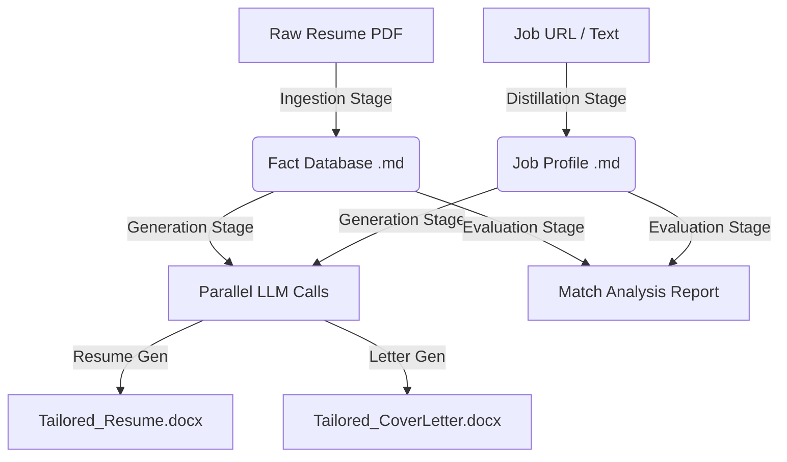

# 🤖 AI Resume Builder (Agentic Edition)

A professional-grade, deterministic application designed to adapt resumes and cover letters with high accuracy using a multi-stage LLM pipeline. Built with **Electron**, **Python**, and **LangChain**.

---

## 📥 Installation

### **Download Pre-Built App (macOS)**

⚠️ **Important:** This app is currently **unsigned**. macOS will show security warnings on first launch.

👉 **[Download Latest Release](https://github.com/raphaelmatori/ai-resume/releases/latest)**

📖 **[Read Installation Guide](INSTALLATION_GUIDE.md)** - Step-by-step instructions to safely install and open the app

**Quick Start:**
1. Download the DMG or ZIP for your Mac (Intel or Apple Silicon)
3. Click "Open" in the security dialog

**Requirements:**
- macOS 10.15 (Catalina) or later
- **Python 3.9+** installed on your system (the app uses your system Python)
- Required Python packages (see [Installation Guide](INSTALLATION_GUIDE.md#python-requirements))

### **Build From Source**

See the "Getting Started" section below for development setup.

---

## 🏗️ Architecture Overview

The system follows a strict **Deterministic Fact Pipeline**. It extracts facts from your resume, stores them in a normalized Markdown database, and then uses only those verified facts to generate tailored applications.

### System Flow


---

## ✨ Key Features

- **⚡ Parallel Processing**: Generates Resume and Cover Letter simultaneously for 2x faster performance.
- **🛰️ Real-Time Heartbeat**: Transparent technical logs with immediate script feedback.
- **🛡️ Audit-Proof Generation**: Every bullet point is tracked back to source facts (tags automatically stripped in final DOCX).
- **📝 High-Fidelity Rendering**: Professional docx styling with Arial typography and clean layouts.
- **🔍 Match Analysis**: Comprehensive scoring and gap analysis to help you understand your fit.
- **🔗 Hybrid Ingestion**: Extract job data directly from URLs or pasted text.

---

## 🚀 Getting Started

### 1. Prerequisites
- **Node.js** (v18+)
- **Python** (3.9+)
- **Google AI Studio Key** (Gemini) or **OpenAI Key**

### 2. Installation
```bash
# Clone the repository
git clone <repo-url>
cd ai-resume

# Install Node dependencies
npm install

# Setup Python Virtual Environment
python3 -m venv venv
source venv/bin/activate  # Windows: venv\Scripts\activate

# Install Python dependencies
pip install -r requirements.txt
```

### 3. Configuration
Create a `.env` file in the root directory:
```env
GOOGLE_API_KEY=your_key_here
OPENAI_API_KEY=your_key_here
DEFAULT_MODEL=gemini-2.5-flash
```

---

## 📖 Usage Guide

### Step 1: Candidate Ingestion
1.  Launch the app: `npm start`.
2.  Use the **Native File Picker** to upload your resume (PDF only).
3.  Click **"Process Candidates"**. This extracts every fact from your document into `data/processed/candidate_profile.md`.

### Step 2: Vacancy Distillation
1.  Paste a job description or provide a Job URL.
2.  Click **"Process Vacancy"**. The system will follow links and extract the core requirements.

### Step 3: Application Generation
1.  Click **"Generate Application"**.
2.  The AI will draft a tailored resume and cover letter in parallel.
3.  Review the **Match Analysis** report to see your fit score (0-100%).
4.  Download or Open your professional DOCX files from the **Output** folder.

---

## 🛠️ Technical Details

### Backend Engines (`/execution`)
- `ingest_candidate.py`: PDF text extraction and fact atomization.
- `ingest_vacancy.py`: Scrapes job data and distill requirements.
- `generate_application.py`: Parallel document drafting using `ThreadPoolExecutor`.
- `analyze_match.py`: Strategic gap analysis and scoring.
- `utils.py`: Robust LLM config with exponential backoff for rate limits.

### Frontend Logic
- `main.js`: Electron main process handling IPC, file system, and Python orchestration.
- `renderer.js`: UI state management, real-time log streaming, and Markdown rendering.

---

## 🔒 Security & Privacy
- **API Keys**: Stored locally in `.env` (gitignored).
- **Data Privacy**: No data is stored in the cloud other than the transient LLM prompts.
- **Generated Data**: All resumes and profiles are stored in the local `data/` and `output/` folders (gitignored).

---

## 🤝 How to Contribute

We welcome contributions! To maintain a clean and effective release process:

1.  **Fork & Clone**: Fork the repository and clone it to your local machine.
2.  **Branching**: Create a feature branch for your changes (e.g., `feature/awesome-new-tool` or `fix/button-bug`).
3.  **Labels**: If you have permissions, please use appropriate labels on your PRs (`feature`, `bug`, `chore`, `ui`, `test`) as these are used to automatically generate the **What's Changed** section in our releases.
4.  **Pull Requests**: Submit a PR to the `main` branch. Provide a clear description of the changes and link to any relevant issues.

---

## ⚖️ License
MIT License. Created with ❤️ for career growth.
